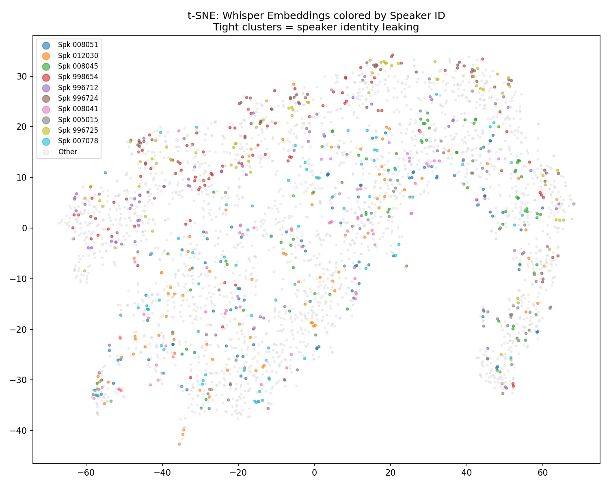
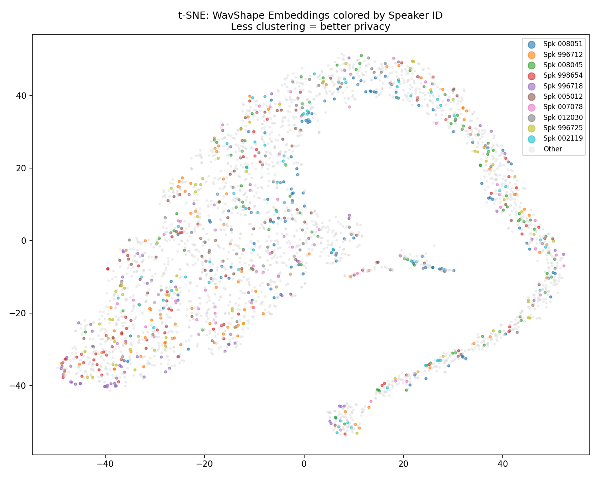

# Privacy-Preserving Children's Speech Recognition

Automatic speech recognition systems trained or fine-tuned on children's speech pose a
distinct privacy risk: the same acoustic embeddings that make ASR accurate also encode
enough speaker-identifying information to re-identify a child from their voice alone.
This project fine-tunes Whisper Small on children's speech and then applies an
information-theoretic projection layer ([WavShape](https://github.com/UTAustin-SwarmLab/WavShape))
to strip speaker-identity information out of the resulting embeddings, while measuring how
much transcription accuracy is traded away to get there.

Concretely, the project asks: **can we reduce how much a Whisper embedding reveals about
*who* a child is, without materially hurting *what* was said?**

## Overview

- **Task attribute (kept):** transcription content, evaluated via Word Error Rate (WER).
- **Sensitive attribute (removed):** speaker identity, evaluated via a speaker-ID classifier's
  AUROC and a Donsker–Varadhan mutual information estimate between embeddings and speaker ID.
- **Dataset:** [MyST Children's Speech Corpus](https://boulderlearning.com/resources/myst/) v0.4.2.
- **Base model:** `openai/whisper-small`, fine-tuned on MyST for the ASR baseline.
- **Privacy layer:** [WavShape](https://github.com/UTAustin-SwarmLab/WavShape) (Baser et al.,
  Interspeech 2025), applied here to a domain (children's speech) not covered in the original
  paper's evaluation (Common Voice, VCTK).

## Repository Structure

```
.
├── README.md                     # This file.
├── docs/
│   └── research_progress.md      # Detailed phase-by-phase experiment log.
├── notebooks/
│   ├── 0-ingest-datasets.ipynb       # MyST corpus loading and preprocessing.
│   ├── 1-baseline-performance.ipynb  # Off-the-shelf Whisper Small WER on MyST.
│   └── 2b-finetune-myst.ipynb        # Whisper Small fine-tuning on MyST.
├── src/
│   ├── extract_embeddings.py         # Whisper encoder embeddings for a single split.
│   ├── extract_all_embeddings.py     # Whisper encoder embeddings for all splits.
│   ├── prepare_wavshape_labels.py    # Builds task/sensitive-attribute label arrays for WavShape.
│   ├── measure_privacy.py            # Speaker-ID AUROC + MI on raw Whisper embeddings.
│   ├── measure_privacy_wavshape.py   # Speaker-ID AUROC + MI on WavShape-projected embeddings.
│   └── eval_wavshape.py              # WER re-evaluation after the WavShape projection.
├── configs/
│   └── wavshape_myst/            # MyST-specific WavShape configs (see Installation).
├── results/
│   ├── baseline_results.json
│   ├── wavshape_results.json
│   ├── tsne_baseline.png
│   └── tsne_wavshape.png
├── embeddings/                   # Generated locally; not tracked (see .gitignore).
├── whisper_finetuned/            # Generated locally; not tracked (see .gitignore).
├── requirements.txt
├── LICENSE
└── WavShape/                     # Git submodule: UTAustin-SwarmLab/WavShape.
```

## Installation

```bash
git clone --recurse-submodules https://github.com/nav-jk/Privacy-Preserving-Children-s-ASR.git
cd Privacy-Preserving-Children-s-ASR
pip install -r requirements.txt
```

If you already cloned without `--recurse-submodules`:

```bash
git submodule update --init --recursive
```

This project adds MyST-specific configs to WavShape that aren't part of the upstream repo.
After initializing the submodule, copy them into place:

```bash
copy configs\wavshape_myst\myst.yaml            WavShape\configs\myst.yaml
copy configs\wavshape_myst\dataset_myst.yaml    WavShape\configs\dataset\myst.yaml
copy configs\wavshape_myst\encoder_myst.yaml    WavShape\configs\encoder\myst.yaml
copy configs\wavshape_myst\simulation_myst.yaml WavShape\configs\simulation\myst.yaml
```

(Linux/macOS: use `cp` in place of `copy` and forward slashes.)

## Data Preparation

MyST v0.4.2 is distributed by Boulder Learning / LDC under its own terms and is **not**
redistributed in this repository. Request access from the corpus provider, then point
`notebooks/0-ingest-datasets.ipynb` at your local copy.

## Usage

The pipeline runs in four phases:

**Phase 1 — ASR baseline.** Fine-tune Whisper Small on MyST and confirm WER improves over
the off-the-shelf model.
```bash
jupyter notebook notebooks/1-baseline-performance.ipynb
jupyter notebook notebooks/2b-finetune-myst.ipynb
```

**Phase 2 — Privacy baseline.** Extract encoder embeddings from the fine-tuned model and
measure how much speaker identity leaks out of them before any mitigation.
```bash
python src/extract_all_embeddings.py
python src/measure_privacy.py
```

**Phase 3 — WavShape projection.** Train the WavShape encoder to compress embeddings while
suppressing speaker-identity mutual information.
```bash
python src/prepare_wavshape_labels.py
cd WavShape
bash scripts/train_encoder.sh --config configs/myst.yaml
cd ..
```

**Phase 4 — Privacy evaluation.** Re-measure WER and speaker leakage on the WavShape-projected
embeddings and compare against baseline.
```bash
python src/eval_wavshape.py
python src/measure_privacy_wavshape.py
```

## Results

### Phase 1: ASR Baseline

| Split | Samples |
|---|---|
| Train | 36,544 |
| Validation | 6,013 |
| Test | 6,321 |
| **Total (91 speakers)** | **102,331** |

| Step | Train Loss | Val Loss | WER |
|---|---|---|---|
| 0 (base Whisper Small) | — | — | ~19% |
| 500 | 0.3370 | 0.4411 | 17.26% |
| 1000 | 0.3131 | 0.4309 | **16.48%** |

### Phases 2–4: Privacy vs. Utility

| Metric | Baseline (Whisper) | After WavShape | Change |
|---|---|---|---|
| WER | **16.48%** | 18.45% | +1.97 pts |
| Speaker-ID AUROC | 0.9953 | **0.7160** | −28.1% |
| MI(embedding; speaker) | 1.5556 | **0.4933** | −68.3% |
| Embedding dimension | 768 | 64 | −91.7% |

WavShape's projection layer was trained with a Donsker–Varadhan MI estimator (768→256→128→64
encoder, 91-speaker sensitive attribute, transcription-preserving task attribute), reducing
MI(embedding; speaker) from 1.5556 to ~0.19 during training and speaker AUROC from 0.9953 to
0.7160 at evaluation, at a cost of about 2 WER points.

### Visualizing the Effect

t-SNE projections of the test-set embeddings, colored by speaker ID. Tight, separable clusters
mean speaker identity is easy to recover from the embedding; a blended, overlapping cloud means
it isn't.

**Before WavShape** — raw Whisper encoder embeddings. Speakers form distinct, well-separated
clusters, consistent with the 0.9953 AUROC above.



**After WavShape** — same test set, projected through the trained WavShape encoder (768→64 dims).
Clusters largely collapse into each other, matching the drop to 0.7160 AUROC and the 68.3% MI
reduction.



### Comparison with the WavShape Paper

| Dataset | MI Reduction | AUROC Reduction |
|---|---|---|
| Common Voice (paper) | ~81% | ~25.8% |
| VCTK (paper) | ~83% | ~38.4% |
| **MyST children's speech (this work)** | **68.3%** | **28.1%** |

The MI and AUROC reductions on MyST are consistent with the paper's results on adult speech
corpora, suggesting the approach generalizes to children's speech — a population for which
privacy-preserving representation learning is arguably more important given the added
sensitivity of biometric data collected from minors.

Full per-phase logs, configs, and artifact paths are in [`docs/research_progress.md`](docs/research_progress.md).

## Ethical Considerations

Children's speech is biometric data from a vulnerable population and warrants extra caution
in collection, storage, and downstream use. This project does not redistribute any MyST audio
or transcripts; only derived, non-reversible summary artifacts (WER, AUROC, MI estimates, and
low-dimensional visualizations) are included in `results/`. Anyone extending this work should
confirm they have appropriate authorization and consent coverage for the underlying corpus
before processing it.

## Acknowledgments

This project builds directly on WavShape:

```bibtex
@inproceedings{wavshape2025,
  title={WavShape: Information-Theoretic Speech Representation Learning for Fair and Privacy-Aware Audio Processing},
  author={Baser, Oguzhan and Tanriverdi, Ahmet E and Kale, Kaan and Chinchali, Sandeep P and Vishwanath, Sriram},
  booktitle={Proc. Interspeech 2025},
  year={2025}
}
```

and on OpenAI's Whisper and the MyST Children's Speech Corpus (Boulder Learning / LDC).

## License

This project's own code is licensed under the MIT License — see [LICENSE](LICENSE). The
`WavShape/` submodule is a separate repository under its own MIT license
(UTAustin-SwarmLab/WavShape); its terms apply to that code independently.

## Contact

- Navaneet Jayakrishnan — [@nav-jk](https://github.com/nav-jk)
